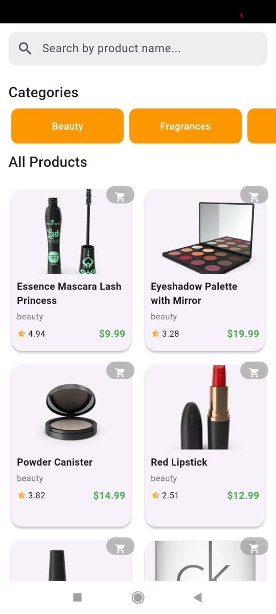
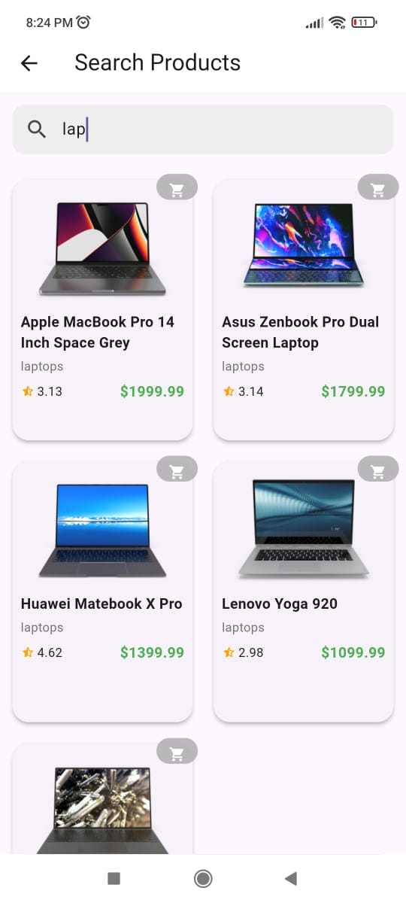
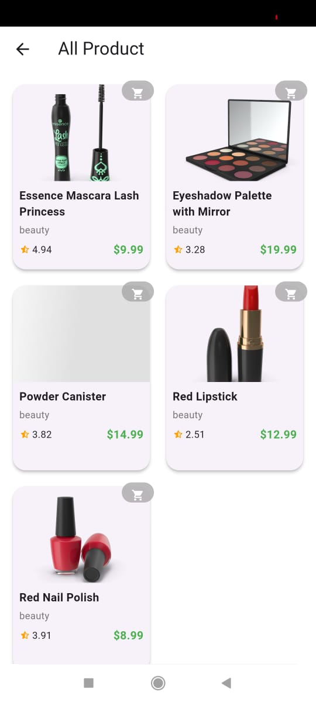

# Flutter Ecommerce App

A beautiful, responsive Flutter app to browse and search products using the DummyJSON API. Built with GetX for state management and routing, the app demonstrates clean architecture, modern UI practices, and reusable components.
## Download APK
(https://drive.google.com/file/d/1ezxOottCN9VS2c5gcC9Qz19BFdbSACxR/view?usp=sharing)

## ✨ Features
### 🧾 Product List Screen
- Fetches up to 100 products using:  
  `https://dummyjson.com/products?limit=100`
- Displays product **image**, **title**, **price**, **rating**, and **category**
- Beautiful card/tile layout with clean spacing and responsiveness
### 📂 Category Filtering
- Dynamically fetches all categories from:  
  `https://dummyjson.com/products/categories`
- Displays Category Button
- Filters products using:  
  `https://dummyjson.com/products/category/{category_name}`

### 📄 Product Details Page
- Shows:
  - Product title
  - Description
  - Price
  - Rating
  - Image carousel (if multiple images)

## 🛠️ Tech Stack
- **Flutter**
- **GetX** (for routing, state, controller logic)
- Clean architecture and folder structure
- Modern UI with responsive design
## 📸 Screenshots

### 🏠 Home Screen

### 📄 Product Detail Page

### 📄 Search Page

### 📄 Category Product Page

